# CarbonEdge
A toolkit to setup and operate a Hyperledger Fabric blockchain consortium for the metering and reporting of greenhouse gas emissions on the edge.
CarbonEdge was created in an iterative design process based on the Design Science methodology. 

| Iteration | Scenario                           | Demonstrator                                            | Architecture |
|-----------|------------------------------------|---------------------------------------------------------|-------------|
| 3rd       | The Coffee Roastery Consortium     | 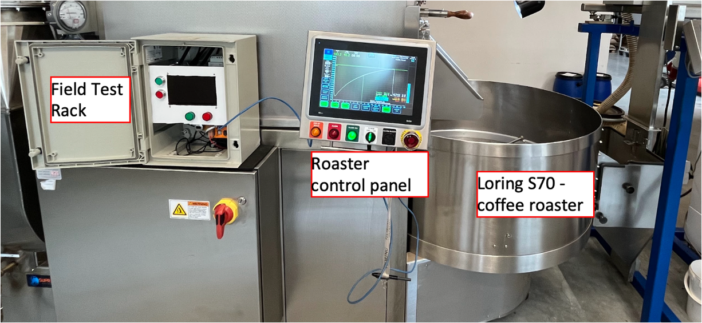   |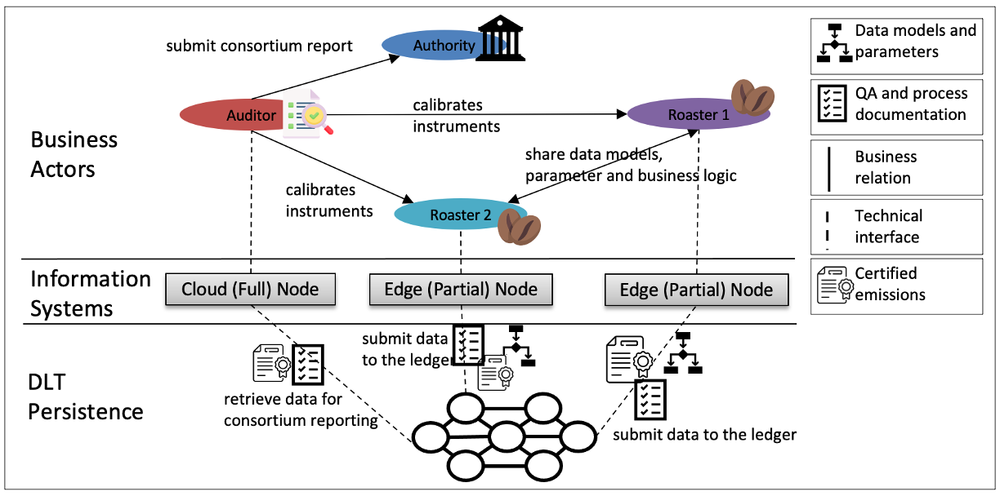             |
| 2nd       | The Biogas Plant Consortium        | 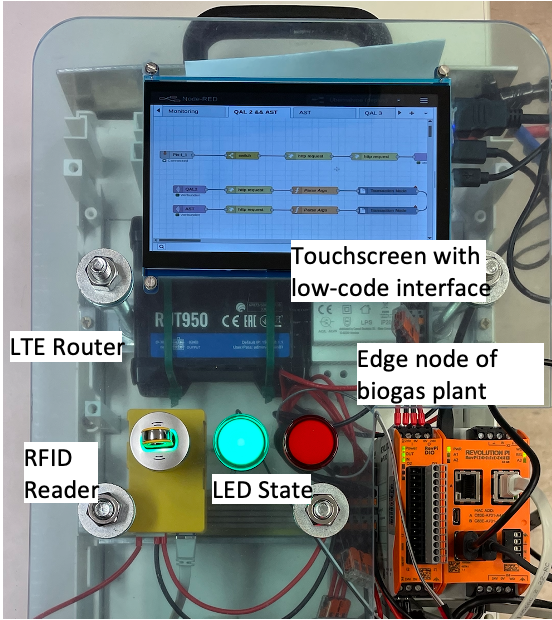 |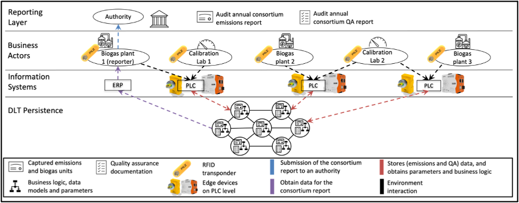             |
| 1st       | The Coffee Supply Chain Consortium | 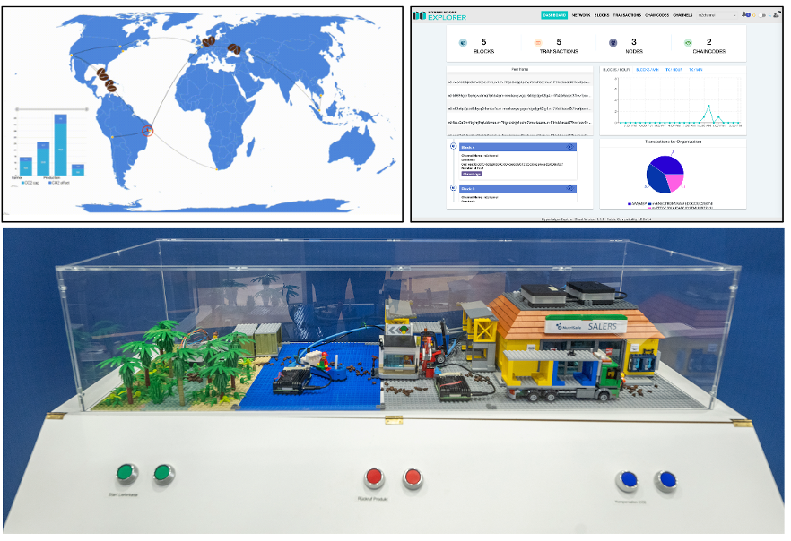   |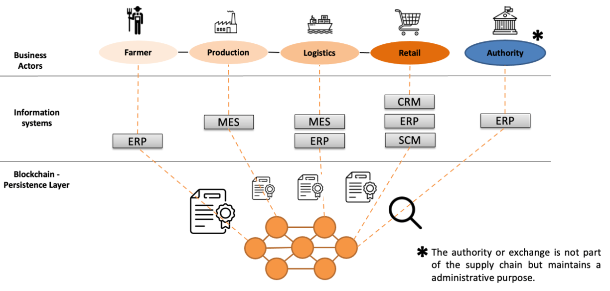             |

## CarbonEdge Highlights. :rocket:

### 2023

#### July

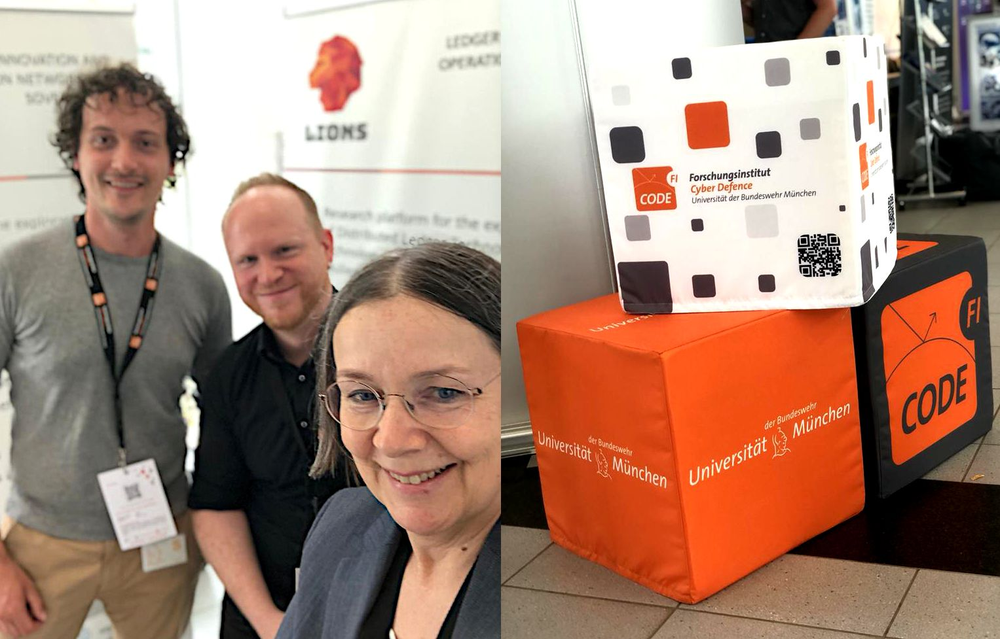

CarbonEdge was represented by Michael Hofmeier, Karl Seidenfad and Ulrike Lechner at the  [CODE](https://www.linkedin.com/feed/update/urn:li:activity:7085175726361989122?utm_source=share&utm_medium=member_desktop) conference on the University of the Bundeswehr München, Munich Germany.

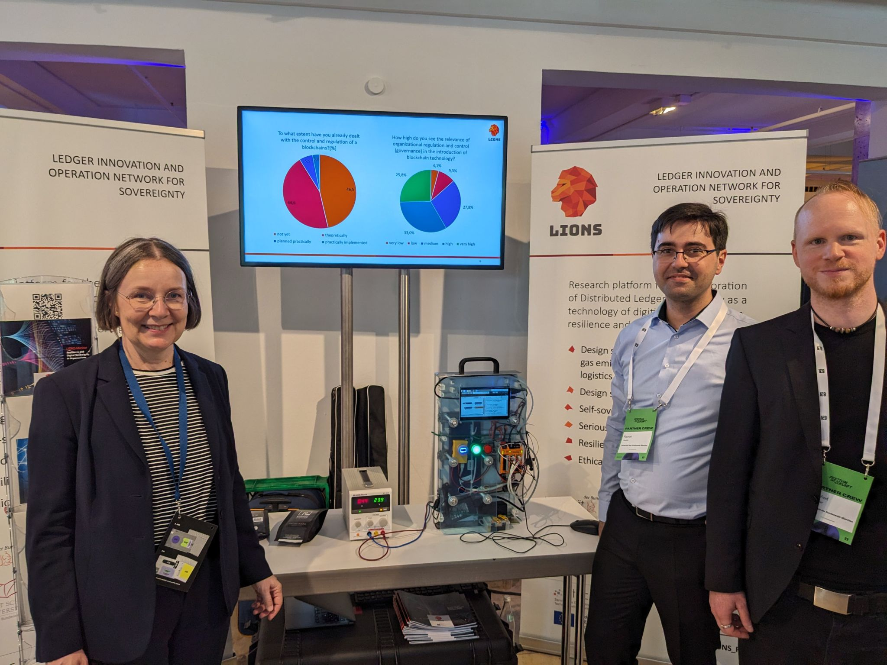

CarbonEdge on the [Festival of the Future](https://festivalderzukunft.com/)  in Munich Germany.

#### May
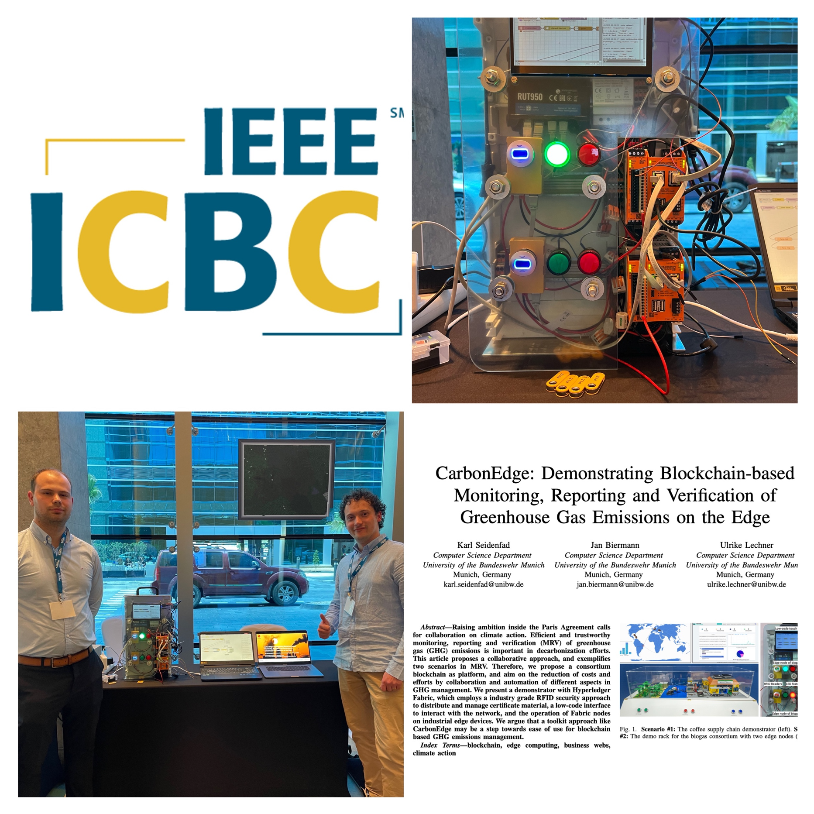

Karl Seidenfad and Jan Biermann present CarbonEdge on the [5th IEEE International Conference
on Blockchain and Cryptocurrency (ICBC) in Dubai](https://www.linuxfoundation.org/research/web3-and-sustainability)  - The flagship conference on blockchain technology.

#### February
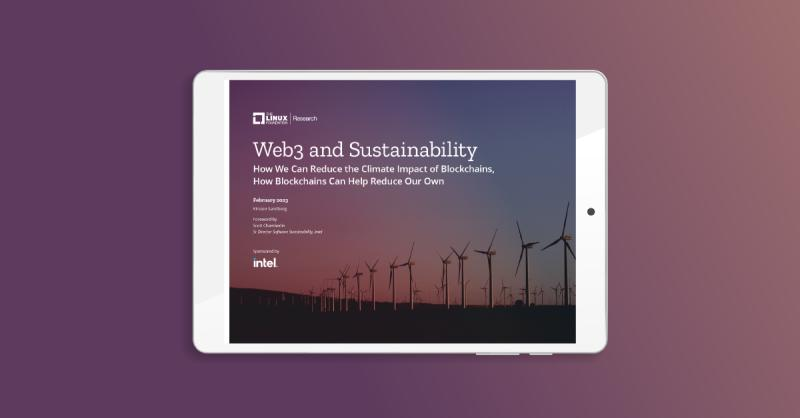

The LINUX Foundation mentions the work on CarbonEdge in their [Web3 and Sustainability](https://icbc2023.ieee-icbc.org/) report for 2023.

### 2022

#### July
 

Karl Seidenfad presents the design and implementation of the coffee supply chain consortum scenario at the 22nd International Conference on Innovations for Community Services at TU Delft.

#### June
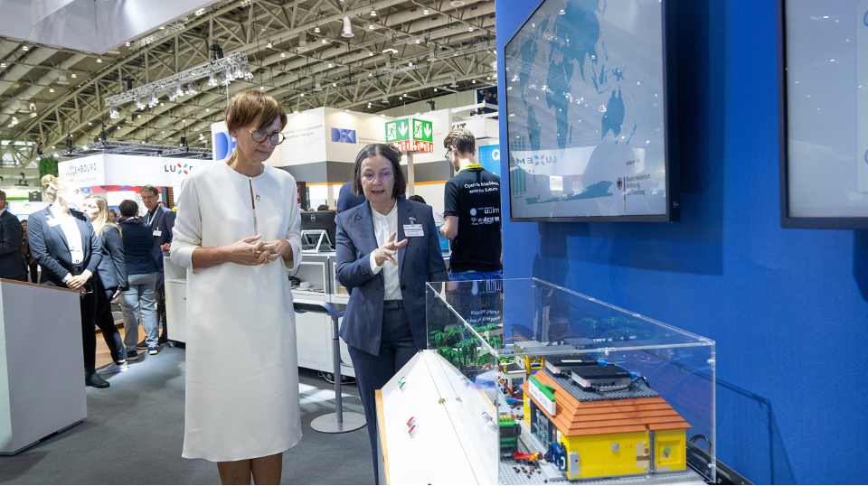  
                                                                                                                             
Prof. Dr. Ulrike Lechner presents the CarbonEdge demonstrator concept to the Minister of the German Education and Research Ministry Ms Bettina Stark-Watzinger at the Hanover Fair 2022.

### 2021

#### November
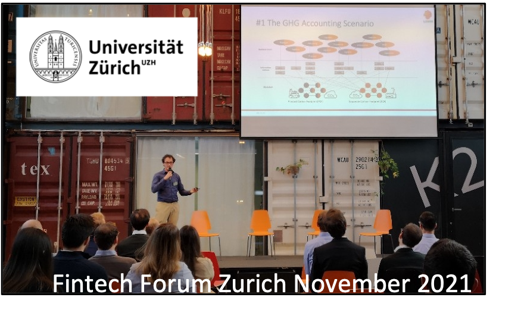  
                                                                                                                             
Karl Seidenfad presents the LIONS project and the first ideation of CarbonEdge on the [International FinTech, InsurTech & Blockchain Forum ](https://www.fintech-forum.org/) in Zurich.