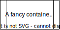

# Software Deployment

This document gathers the software artifacts of this project and describes the general strategy of software deployment.

- [Software Deployment](#software-deployment)
  - [1. Deployment Architecture](#1-deployment-architecture)
  - [2. Host System Requirements](#2-host-system-requirements)
  - [3. Containers](#3-containers)
    - [Container List](#container-list)
    - [Container Setup](#container-setup)
  - [4. Smart Contracts](#4-smart-contracts)

## 1. Deployment Architecture
...  
E.g. our layer model of softwre artifacts...

 

## 2. Host System Requirements

...

| Software  | Version | Link                                       | Content |
| --------- | ------- | ------------------------------------------ | ------- |
| Docker    | ...     | https://docs.docker.com/engine/install/    | no      |
| x         | 1       | x                                          |         |
| x         | 1       | x                                          |         |
| x         | 1       | x                                          |         |
| x         | 1       | x                                          |         |
| x         | 1       | x                                          |         |
<!--For formating tables in markdown use this vsCode exntension https://marketplace.visualstudio.com/items?itemName=salesforce.sfdocs-markdown-assistant&ref=hackernoon.com -->

## 3. Containers
This project utilizies a set of docker containers to deploy software. Therefore, we rely on officially maintained images, but also build our own images with customization.

### Container List
| Software           | Version | Link                                                                    | Content                          |
| ------------------ | ------- | ----------------------------------------------------------------------- | -------------------------------- |
| node-RED           | x       | https://hub.docker.com/r/nodered/node-red/                              |                                  |
| grafana            | x       | https://hub.docker.com/r/grafana/grafana                                |                                  |
| eclipse mosquitto  | x       | https://hub.docker.com/_/eclipse-mosquitto                              |                                  |
| carbonmeter webapp | x       | https://hub.docker.com/repository/docker/ksilkthread/carbonmeter-webapp | nginx + webapp as static content |
| fabric-ca          | x       | https://hub.docker.com/repository/docker/laughingadversial/fabric-ca                                                                       |                                  |
| fabric-peer        | x       | https://hub.docker.com/repository/docker/laughingadversial/fabric-peer                                                                       |                                  |
| fabric-orderer     | x       | https://hub.docker.com/repository/docker/laughingadversial/fabric-orderer                                                                       |                                  |
| fabric-tools       | x       | https://hub.docker.com/repository/docker/laughingadversial/fabric-tools                                                                       |                                  |
| fabric-baseos                 | x       |  https://hub.docker.com/repository/docker/laughingadversial/fabric-baseos                                                                      |                                  |
| fabric-javaenv               | x       |  https://hub.docker.com/repository/docker/laughingadversial/fabric-ccenv                                                                      |                                  |
| x                  | x       | x                                                                       |                                  |
<!--For formating tables in markdown use this vsCode exntension https://marketplace.visualstudio.com/items?itemName=salesforce.sfdocs-markdown-assistant&ref=hackernoon.com -->

### Container Setup
...
A map of the exisiting containers and their settings e.g., port forwarding and relationships

 

## 4. Smart Contracts