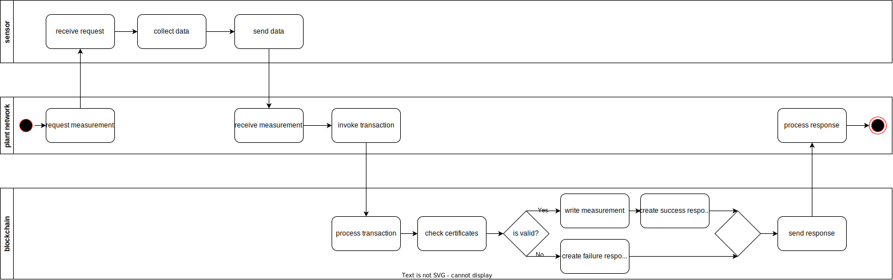
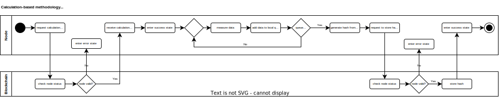
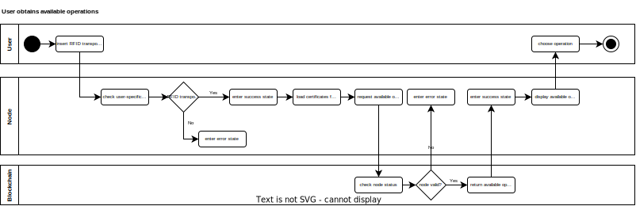
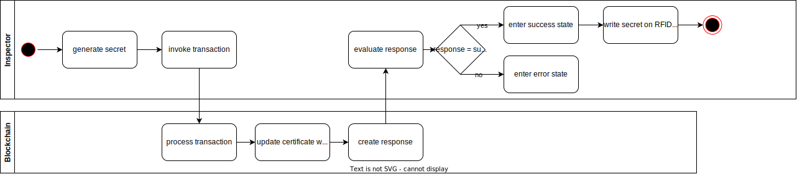
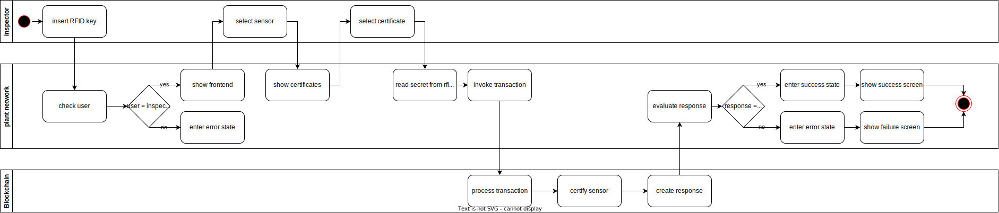
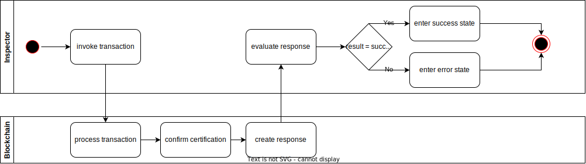

# Interaction with the edge devices

This document describes general interaction patterns (e.g., measuring) on implementation level and references to specific regulatory processes (e.g., for quality assurance).

1. [Measurement based methodology](#1-measurement-based-methodology)
2. [Calculation based methodology](#2-calculation-based-methodology)
3. [Certification of automated measuring system (AMS)](#3-certification-of-automated-measuring-system-ams)
4. [Continuous quality assurance of automated measuring system (AMS) in operation](#4-continuous-quality-assurance-of-automated-measuring-system-ams-in-operation)
5. [Installation, calibration and validation of automated measuring system (AMS)](#5-installation-calibration-and-validation-of-automated-measuring-system-ams)

## Measurement methodologies

In general our project offers two measurement methods.

### 1. Measurement based methodology

 
 
 This method is suitable for exact measurement of emissions by measurement devices like sensors. The diagram shows a high level process of our implementation with three main components the sensor, the plant network and the blockchain. 
 The process starts with an event, which triggers the process. An event could be a specific elapsed time or a received signal, which was initiated by pressing a button. The next step is to request data from the sensor or measurement device. The device sends a response with the measured emissions back to the plant network, which processes the data and invokes a transaction to the blockchain. Now the transaction is processed by the blockchain, which cheks whether all certificates exist and are valid. If the checks are successful, a success response will be returned to the plant network. Otherwise the blockchain returns a failure response.

### 2. Calculation based methodology
...

 

## 3. Certification of automated measuring system (AMS)
...

## 4. Continuous quality assurance of automated measuring system (AMS) in operation
This section gathers general operations, associated with the continuous quality assurance of a automated measuring system in operation. 

### User obtains available quality assurance operations from the network

 

## 5. Installation, calibration and validation of automated measuring system (AMS)
...

...

...

...

