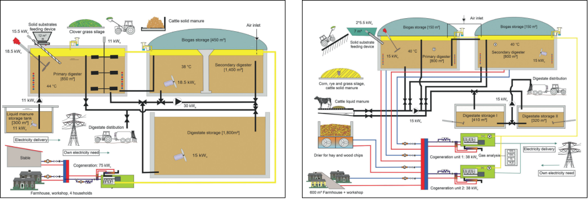

# Blockchain-based collaborative emissions metering for biogas production and combined heat and power plants (CHP/BHKW in german)

## 1. Environment
...  

<figure>
  
 <figcaption>Technical environment; Source: https://www.euki.de/wp-content/uploads/2021/03/Brochure_Biogas-Initiative_WEB.pdf</figcaption>
 </figure>

## 2. Collaboration potential

## 3. Consortium setup