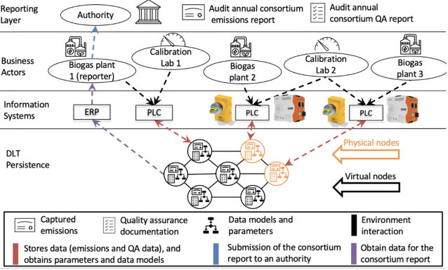

# Blockchain-based collaborative emissions metering for biogas production and combined heat and power plants (CHP/BHKW in german)

## 1. Scenario description
The local production of biogas and the consumption by a CHP plant prevents greenhousegas emissions by landfill gas (e.g., methan) (CDM: AMS-III.D.), and may serve as a stand-alone supply of heat and electricity (e.g., for farms). Depending of the actual plant size, the self-usage or delivery of biogas to to third parties, the operation demands the maintenance of certain metering and documentation tasks. By design edium and small-scale CHP plants have a lower efficiency then centralizedlarge scale CHP plants. While thermical/chemical processes getting continuously improved, the actual process of metering and documentation remains mainly manual and highly reptitive. The collaboration of numerous operators (e.g., farms) to scale-up the process of metering and reporting can be a driver for lower costs in this regard.

<figure>
  
 <figcaption>Technical environment; Source: https://www.euki.de/wp-content/uploads/2021/03/Brochure_Biogas-Initiative_WEB.pdf</figcaption>
 </figure>

## 2. Collaboration potential

- Logging of data about captured GHG emissions and quality assurance (QA) tasks.
- Checking transaction compliance (e.g., QA deadlines, regulatory thresholds, or data consistency).
- Provisioning of data models and parameters (e.g., calculation models) to rather approximate GHG emissions, or to evaluate measured values, instead of increasing measurement efforts. Furthermore, we propose distributing application logic for the Node-RED low-code interface. Node-RED stores and shares application logic as a JSON data structure with a relatively small memory footprint, which we provide on the blockchain.

## 3. Consortium setup

Collaboration in this scenario is about biogas production, and introduces professional industrial equipment, the usage of an RFID-enhanced security concept, and a low-code approach interacting with the blockchain. This scenario concerns biogas plants that jointly report their amount of produced biogas. The consortium operates three biogas plants, including calibration laboratories for supportive tasks (e.g., the  calibration of instruments). The consortium of this scenario is characterized by actors with similar activities, potentially competing in the same business field. Hence, we must deal with a limited amount of trust. However, the plant operators in the **business actors layer** share an interest in cost-efficient processes and compliance with regulations (e.g., reporting produced biogas units). We propose in our design that sharing efforts by collaborative automation of reporting tasks is a strategy to reach the desired cost-efficiency. In the **information systems layer**, each biogas plant operates an edge node on site. These edge nodes are connected with instruments and run a Hyperledger Fabric peer. While all biogas plants commit data automatically, one actor takes the role of a "reporter." This reporter obtains data from the **DLT persistence layer** and composes a joint audit trail for the public authority inside the **reporting layer**.

<figure>
  
 <figcaption>The biogas consortium with its actors in a layered architecture. ERP - Enterprise Resource Planning; PLC - Programmable Logic Controller</figcaption>
 </figure>