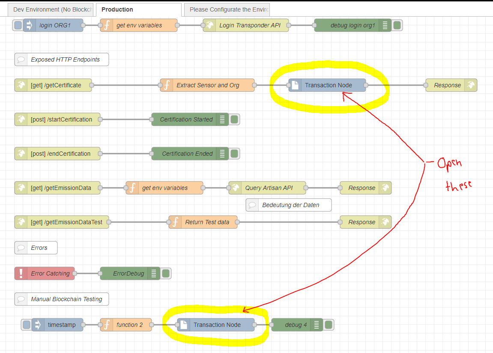
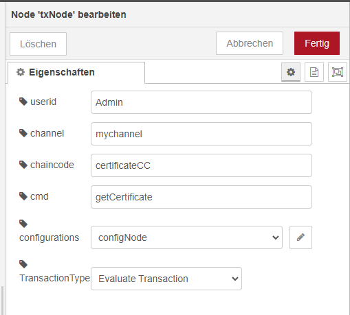
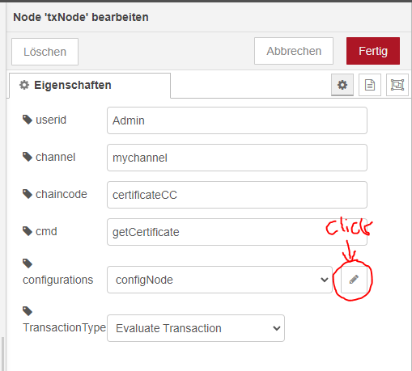
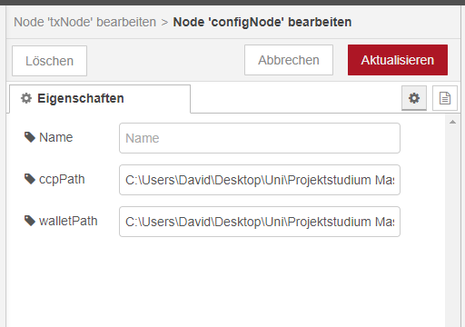
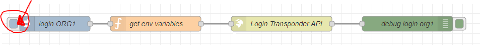
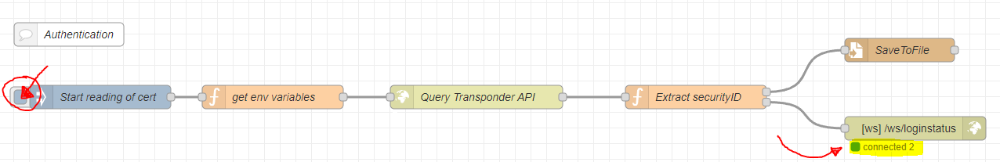
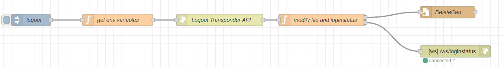
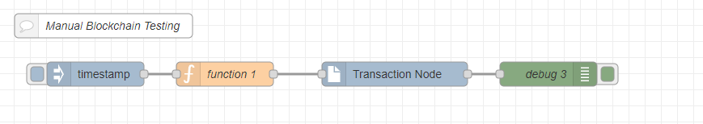

# Node-RED Backend for the CarbonEdge Dashboard

## Installation

1. Checkout the complete repo.
2. Go to: `/carbonedge/scenarios/coffee-roaster-MRV-ecosystem/node-red-application`
3. Do: `npm install ./fabric-nodered-nodes/`
4. Do (still same directory): `node-red -u ./`
5. Start the PITReader (either the mock/fake PITReader as in `/carbonedge/scenarios/coffee-roaster-MRV-ecosystem/pitreader-faker` or the production device)
6. Open `http://localhost:1880`
7. Navigate to the Tab "Please Configurate the Environment Variables"
8. Open the Function named "set environment variables" below the comment element
9. Configure all of these Values as required (URLs to API endpoints of PITReader and Artisan, and Organisation IDs), especially the absolute path to the local copy of the Admin.id file. This folder can be found within the `/carbonedge/scenarios/coffee-roaster-MRV-ecosystem/node-red-application` folder and it should include a Admin.id file. You need to enter the absolute path to this file into the configuration.
10. Hit deploy in the upper right corner
11. Click on the Inject Node named "Click here to save environment variables"
12. Navigate to the "Dev Environment (No Blockchain or Artisan)" or "Production" Tab.
13. If you want to run the application connected to a Hyperledger Fabric Network do the following: 
    Step 1: Open TxNodes
    
    Step 2: Do configurations here. Per default Admin, mychannel, certificateCC, getCertificate and Evaluate Transaction dont need to be changed, unless your network is configured otherwise
    
    Step 3: Click here to Open the Config Node
    
    Step 4: Change the absolute paths here.

ccpPath needs to point to the file `your mychannel_connection_for_nodesdk.json`
You can obtain this file from your minifabric installation directory from the folder `<your-path>\vars\profiles`.
Your whole path should include the filename and ending like this: `C:\Users\David\Desktop\Uni\Projektstudium Master\Repository\carbonedge\scenarios\coffee-roaster-MRV-ecosystem\node-red-application\channel\mychannel_connection_for_nodesdk.json`

walletPath needs to point to the folder wallet within the node-red-application directory (The folder where the Admin.id is located)
Your whole path should only include the top-level folder, not the Admin.id file. For example like this: `C:\Users\David\Desktop\Uni\Projektstudium Master\Repository\carbonedge\scenarios\coffee-roaster-MRV-ecosystem\node-red-application\wallet`

## Usage

### Step 1: Login with PITReader

First of all click the inject node of the organisation you want to log in with the PITReader. See the image above for where to click. If you want to log into Org0 instead click on the respective other inject node. This step is simulation only as this and the following step are automatically performed at once in production.

### Step 2: Start reading of the certificate

To read the certificate from the PITReader and store it into the Admin.id file for authenticating with the blockchain, click on the inject node "Start reading of cert" as shown in the screenshot above. This will trigger the payload of the PITReader to be saved into the Admin.id file (Whose path you had specified earlier), and in parallel, send a WebSocket Message to the frontend, if it is running. You can see whether the frontend is running and has successfully connected to the websocket by the green indicator below the WebSocket-Out-Node showing a green signal and "connected 2".

### (Optional) Step 3: Logout

To logout of the PITReader and indicate the frontend to move the user back to the login screen, please click the inject node "logout" of the flow shown in the screenshot above. This will delete the contents of the Admin.id file and send a new WebSocket message to the Frontend. Here you can see again, whether the frontend is running and has successfully connected to the websocket by the green indicator below the WebSocket-Out-Node showing a green signal and "connected 2".

### (Optional): Manual blockchain testing

You can optionally test the blockchain manuall with click injects with the flow presented in the upper image.
